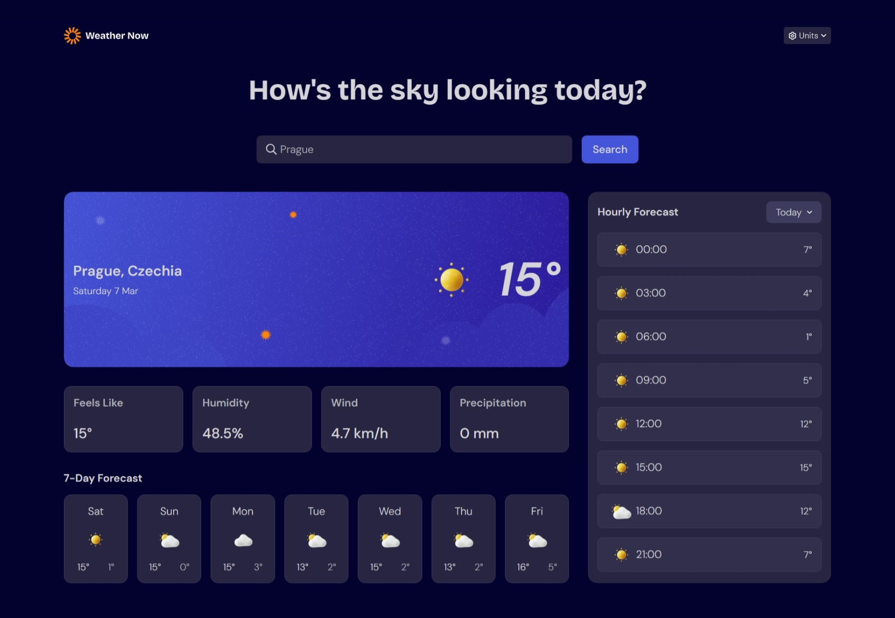

# Frontend Mentor - Weather app solution

This is a solution to the [Weather app challenge on Frontend Mentor](https://www.frontendmentor.io/challenges/weather-app-K1FhddVm49). Frontend Mentor challenges help you improve your coding skills by building realistic projects.

## Table of contents

- [Overview](#overview)
  - [The challenge](#the-challenge)
  - [Screenshot](#screenshot)
  - [Links](#links)
- [My process](#my-process)
  - [Built with](#built-with)
  - [What I learned](#what-i-learned)
  - [Continued development](#continued-development)
  - [AI Collaboration](#ai-collaboration)
- [Author](#author)

## Overview

### Screenshot

### Links

- Solution URL: [Repository](https://github.com/Niisari/weather-app)
- Live Site URL: [Weather App](https://niisari.github.io/weather-app/)

## My process

### Built with

- Semantic HTML5 markup
- CSS custom properties
- Flexbox
- CSS Grid
- Mobile-first workflow
- [Webpack](https://webpack.js.org/) - JS library

### What I learned

I've learned how to use and inject API data into the UI. I also learned from few of my mistakes to separate concerns into smaller components for better code readability (i didn't do this well in this project) and reusability.

### Continued development

Later on as i learn React i might refactor this project into using React instead of Webpack.

### AI Collaboration

I've used Gemini AI to brainstorm what next steps to take and to help me debugg code.

## Author

- Frontend Mentor - [@Yushi](https://www.frontendmentor.io/profile/Niisari)
